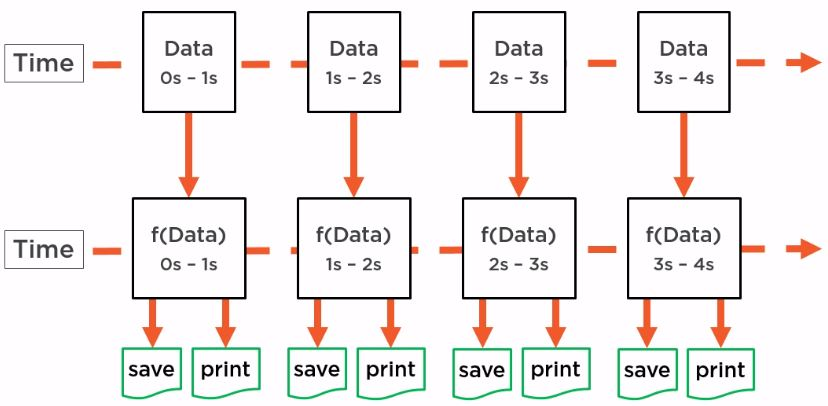

The core abstraction is known as a DStream, representing a discretized of RDDs built up over time. As time passes and data arrives, it's grouped together into time buckets, where the bucketing interval is based on your specified batch size, set during creation of the streaming context. 

For example, our batch size will be 1: 


The DStream bastraction is itself built on top of RDDs, where data bucket is really just an RDD. In fact, the operations you specify for your DStreams end up translating into operations on each underlying RDD. This tie to the underlying core often makes it simpler to context switch between batch logic and stream logic. 

There are no point in transformating data if you don't push it to some external system, be it an output operation. You can even assign multiple output operations; however, by default, they work sequentially, following the order you specified in your application: every increase in the number of ouput jobs translates into an increase in overall batch time. So, if you do have multiple output and are looking to increase your throughput, then you can increase the parallelism via spark. 



If you have more multiple outputs and are looking to increase your throughout, then you can increase increase the parallelise via a Spark

```java
spark.streaminh.concurrents 
```
Let's see how the overall process works. Streaming context acts the central coordinator, and that the each input  source .

